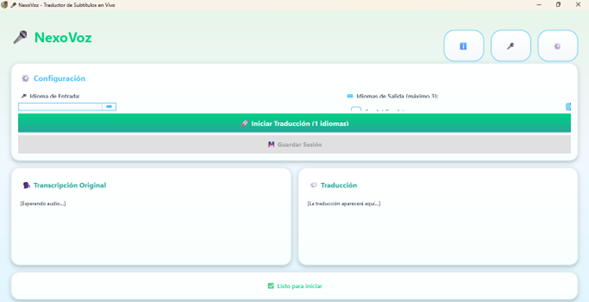
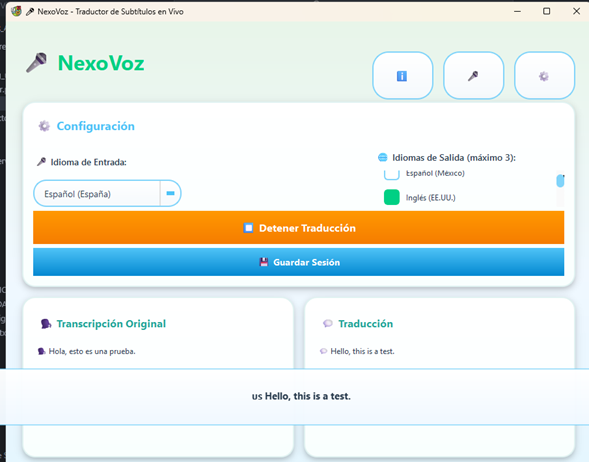

# 🎙️ NexoVoz – Traductor de Voz en Tiempo Real con Azure


NexoVoz es una aplicación de **traducción simultánea en tiempo real** que captura audio desde un micrófono, lo transcribe mediante reconocimiento de voz y lo traduce automáticamente utilizando servicios de **Microsoft Azure Cognitive Services**.

El sistema permite generar **subtítulos en vivo durante presentaciones, conferencias o clases**, facilitando la comunicación entre personas que hablan diferentes idiomas.

---

# 📌 Descripción del proyecto

NexoVoz fue desarrollado como un proyecto académico enfocado en la integración de tecnologías de inteligencia artificial para el procesamiento del lenguaje.

El sistema captura el audio del micrófono, lo procesa mediante servicios de reconocimiento de voz, genera una transcripción del discurso y posteriormente traduce el contenido al idioma seleccionado.

El resultado se muestra en forma de **subtítulos en tiempo real**, lo que permite a los asistentes seguir el contenido de una presentación sin importar el idioma original.

---

# 🎯 Objetivo del sistema

Desarrollar una herramienta de **traducción automática de discursos en tiempo real**, capaz de generar subtítulos multilingües durante presentaciones académicas, conferencias o eventos internacionales.

El objetivo principal es **reducir la barrera idiomática en entornos educativos y profesionales**.

---

# 👨‍💻 Autores

Walter Danilo Noguera Quintero  
Ingeniería de Sistemas – Universidad de la Amazonia  

Yeison Jhoan Cadena Córdoba  
Ingeniería de Sistemas – Universidad de la Amazonia  

Juan Felipe Loaiza Facundo  
Ingeniería de Sistemas – Universidad de la Amazonia  

Docente orientador  
Jesús Emilio Pinto Lopera

---

# 🌐 Tecnologías utilizadas

El sistema fue desarrollado utilizando las siguientes tecnologías:

- Python
- Azure Cognitive Services
- Azure Speech SDK
- Azure Translator API
- MongoDB
- Procesamiento de audio en tiempo real
- Interfaz gráfica en Python

---

# ☁️ Servicios de Azure utilizados

## Azure Speech Service

Permite convertir audio en texto utilizando reconocimiento automático del habla.

## Azure Translator

Permite traducir automáticamente el texto generado por el reconocimiento de voz.

---

# 🏗️ Arquitectura del sistema

El sistema sigue una arquitectura modular que separa las funciones de captura de audio, procesamiento del lenguaje y visualización de resultados.

```
Micrófono
↓
Captura de audio
↓
Procesamiento de señal
↓
Azure Speech Service
↓
Transcripción del discurso
↓
Azure Translator
↓
Texto traducido
↓
Interfaz gráfica
↓
Subtítulos en vivo
```

Este flujo permite que la traducción aparezca en pantalla con una latencia mínima.

---

# 🔧 Componentes del sistema

El sistema está compuesto por diferentes módulos que trabajan de forma integrada.

### Captura de audio

Encargado de obtener la señal de audio desde el micrófono del sistema.

### Procesamiento de audio

Aplica filtros para mejorar la calidad del sonido:

- supresión de ruido
- cancelación de eco
- control automático de ganancia

### Reconocimiento de voz

Utiliza **Azure Speech Service** para convertir la señal de audio en texto.

### Motor de traducción

El texto generado se envía al servicio **Azure Translator** para su traducción automática.

### Interfaz gráfica

La interfaz muestra la transcripción original y la traducción generada en tiempo real mediante subtítulos.

### Registro de datos

Se utiliza **MongoDB** para almacenar registros del funcionamiento del sistema.

---

# 🔄 Flujo de funcionamiento

El proceso interno del sistema sigue las siguientes etapas:

1. Captura del audio desde el micrófono.
2. Procesamiento de la señal de audio.
3. Envío del audio al servicio Azure Speech.
4. Conversión del discurso en texto.
5. Envío del texto al servicio Azure Translator.
6. Traducción automática al idioma seleccionado.
7. Visualización de subtítulos en tiempo real.

---

# 🎥 Demostración del sistema

## Interfaz principal



## Subtítulos en vivo



---

# 📂 Estructura del proyecto

```
traductor_azure
│
├── assets/
│ ├── interfaz.png
│ ├── subtitulos.png
│ └── icono_traductor.png
│
├── config/
│ └── nexovoz_config.json
│
├── docs/
│ ├── CONFIGURACION_AUDIO_OMNIDIRECCIONAL.md
│ ├── FUNCIONALIDAD_MULTI_IDIOMA.md
│ ├── Manual de Usuario.docx
│ └── Manual_tecnico.docx
│
├── src/
│ ├── main.py
│ ├── azure_worker.py
│ ├── audio_config_ui.py
│ ├── config.py
│ ├── mongodb_service.py
│ ├── styles.py
│ ├── logger.py
│ └── ui.py
│
├── requirements.txt
├── README.md
└── .gitignore
```

---

# ⚙️ Requisitos

Para ejecutar la aplicación se requiere:

- PC con mínimo **4 GB de RAM**
- micrófono funcional
- conexión a internet
- cuenta activa en **Microsoft Azure**
- servicios habilitados de Speech y Translator

---

# ⚙️ Instalación

Clonar el repositorio


git clone https://github.com/Pipe6100/traductor_azure.git


Entrar al proyecto


cd traductor_azure


Crear entorno virtual


python -m venv venv


Activar entorno virtual

Windows


venv\Scripts\activate


Linux / Mac


source venv/bin/activate


Instalar dependencias


pip install -r requirements.txt


---

# ▶️ Ejecución del sistema


python src/main.py


---

# 🎤 Funcionalidades principales

El sistema permite:

- reconocimiento de voz en tiempo real
- traducción automática multilenguaje
- generación de subtítulos en vivo
- configuración avanzada de audio
- supresión de ruido ambiental
- cancelación de eco
- control automático de ganancia
- ajuste de sensibilidad del micrófono

---

# 🎬 Casos de uso

El sistema puede utilizarse en diferentes contextos como:

- congresos académicos
- conferencias internacionales
- clases bilingües
- eventos multilingües
- presentaciones con subtítulos en vivo

---

# ⚡ Rendimiento

El sistema fue diseñado para operar con baja latencia.

En condiciones normales la traducción aparece entre **1 y 3 segundos** después de que se pronuncia la frase.

Factores que influyen en el rendimiento:

- calidad del micrófono
- estabilidad de la conexión a internet
- latencia de los servicios de Azure
- nivel de ruido ambiental

---

# 📊 Aplicaciones potenciales

La tecnología implementada puede aplicarse en diferentes contextos:

- educación internacional
- congresos científicos
- turismo
- comunicación empresarial
- accesibilidad para personas con discapacidad auditiva
- eventos multiculturales

---

# 📚 Área de investigación

Este proyecto se relaciona con las siguientes áreas de estudio:

- Inteligencia Artificial aplicada
- Procesamiento de Lenguaje Natural
- Reconocimiento automático del habla
- Traducción automática neuronal
- Sistemas de asistencia multilingüe

---

# 🔐 Seguridad

Las claves de Azure no deben almacenarse directamente en el repositorio.

Se recomienda utilizar variables de entorno.

```
AZURE_SPEECH_KEY
AZURE_SPEECH_REGION
AZURE_TRANSLATOR_KEY
AZURE_TRANSLATOR_REGION
```

---

# 📄 Documentación

El repositorio incluye documentación adicional:

Manual técnico del sistema(https://docs.google.com/document/d/1eeRgAkRW4Ri2wKqOIiRjO0gnj73C_nZt/edit)  
Manual de usuario(https://docs.google.com/document/d/1s3w4PvfknODNDu3h8kxtNhJcEFrDR7Pr/edit)

---

# 🔧 Mejoras futuras

Entre las posibles mejoras del sistema se encuentran:

- traducción simultánea a múltiples idiomas
- síntesis de voz para reproducir traducciones
- exportación automática de transcripciones
- soporte para múltiples micrófonos
- integración con plataformas de videoconferencia
- desarrollo de una versión web del sistema

---

# ⭐ Reconocimientos

Este proyecto fue desarrollado como ejercicio académico dentro del programa de **Ingeniería de Sistemas de la Universidad de la Amazonia**, integrando conocimientos de desarrollo de software, inteligencia artificial y servicios en la nube.

---

# 📜 Licencia

Proyecto académico y de demostración.